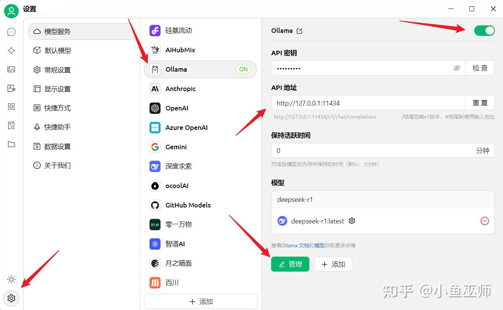

在人工智能技术蓬勃发展的当下，DeepSeek-R1

模型凭借其出色的性能表现，吸引了众多技术爱好者的目光。如果你也渴望在本地部署该模型，深入探索其强大功能，那么这篇攻略将为你提供详细的指导。
一、基础环境搭建
（一）安装 Ollama

常规下载
首先，访问Ollama 官网 ，根据你的操作系统（Windows、Mac 或 Linux），选择对应的安装包进行下载。下载完成后，按照安装向导的提示逐步完成安装。在安装过程中，Ollama 服务会自动在电脑后台运行。对于 Linux 系统用户，还可以在终端执行curl -fsSL https://ollama.com/install.sh | sh来完成安装。

解决网络慢问题
如果在下载过程中遇到网络速度过慢的情况，可以尝试以下方法：
highlighter- awk
https://github.moeyy.xyz/

安装验证
安装完成后，为了确认 Ollama 是否成功安装，在终端输入ollama -v 。如果安装正确，终端会显示 Ollama 的版本号，这就表明你已经成功完成了基础环境搭建的第一步。
highlighter- ebnf
ollama -v
二、模型部署
（一）依据硬件精准选型

打开Ollama 模型库 ，你会看到丰富多样的 DeepSeek-R1 模型版本，如 1.5B、7B、32B 等。根据自身电脑硬件配置来选择合适的模型版本至关重要。

    低配置硬件适配：如果你的电脑硬件配置较为基础，CPU 是老旧的双核或四核处理器，运行内存仅有 8GB 及以下，显卡为集成显卡或者独立显卡的显存不足 2GB ，那么 DeepSeek-R1-Distill-Llama-1.5B 模型是最佳选择。它对硬件资源的需求极低，能够在这样的设备上稳定运行，轻松应对日常对话、简单文本生成等基础文本处理任务，满足你的日常使用需求。

    中配置硬件适配：若你的电脑配置处于中等水平，配备像英特尔酷睿 i5 系列或者 AMD 锐龙 5 系列这样性能不错的 CPU，内存达到 16GB，显卡显存为 4 - 6GB ，那么 DeepSeek-R1-Distill-Llama-7B 或 DeepSeek-R1-Distill-Qwen

    -7B 模型将是你的得力助手。这类模型在中等配置的电脑上能够充分发挥潜力，运行效率较高，能够轻松处理简单代码生成、文章润色等具有一定复杂度的任务，帮助你完成更多有挑战性的工作。

    高配置硬件适配：对于电脑硬件配置高端的用户，拥有英特尔酷睿 i7/i9 系列或 AMD 锐龙 7/9 系列这种高性能 CPU，内存达到 32GB 及以上，显卡搭载 NVIDIA GeForce RTX 30 系列、AMD Radeon RX 6000 系列等高性能独立显卡，显存高达 8GB 及以上，此时 DeepSeek-R1-Distill-Llama-32B 甚至更高版本的模型，才是充分发挥你电脑硬件实力的不二之选。它们能够承担复杂的自然语言处理任务，如专业领域的文本深度分析、复杂代码的编写与调试等，为你带来高效且优质的使用体验。
（二）顺利下载与稳定运行

确定适合自己电脑配置的模型版本后，就可以开始下载和运行模型了。打开终端或 CMD 命令窗口，输入对应的运行指令：

    若选择 1.5B 版本，输入ollama run deepseek-r1:1.5b 。

    若选择 7B 版本，输入ollama run deepseek-r1:7b 。

    若选择 32B 版本，输入ollama run deepseek-r1:32b 。
三、打造专属 AI 聊天室
（一）下载 Chatbox
客户端

为了更便捷地与部署好的 DeepSeek-R1 模型进行交互，你可以下载开源客户端 Chatbox。访问官网 即可进行下载。Chatbox 支持中文界面与 Markdown 渲染，使用起来非常方便。

（二）关键配置

下载安装好 Chatbox 后，打开软件进行关键配置：

    API 类型：选择 “OLLAMA”，这一步能确保 Chatbox 与我们部署的 DeepSeek-R1 模型进行正确通信。

    接口地址：填写http://localhost:11434 ，这个地址是 Ollama 服务的默认接口地址，通过它 Chatbox 可以连接到本地运行的 DeepSeek-R1 模型。

    模型名称：务必填写与之前下载的模型版本完全一致的名称，例如，如果之前下载的是 7B 版本，模型名称就必须填写deepseek-r1:7b ，否则可能会导致连接失败。
（三）安装配置 “Cherry Studio”

下载
前往Cherry Studio 官方网站，根据你的操作系统（支持 Windows、Mac 和 Linux）下载对应的安装包。

安装
下载完成后，对于 Windows 系统，双击安装包，按照安装向导提示完成安装，期间可能需要同意用户协议、选择安装路径等常规步骤；对于 Mac 系统，将下载的应用程序文件拖移到 “应用程序” 文件夹；Linux 系统用户根据下载的安装包类型（如.deb 或.rpm），在终端使用相应命令进行安装，例如对于.deb 包，在终端进入安装包所在目录，执行sudo dpkg -i [安装包名.deb] 。
配置
打开 Cherry Studio，在设置中找到 “模型设置” 选项。

    模型选择：从模型列表中选择与你本地部署的 DeepSeek-R1 模型版本对应的选项，如果没有直接匹配项，选择支持自定义模型配置的入口。

    自定义配置：在自定义配置中，将 API 地址设置为http://localhost:11434 ，这是 Ollama 服务的默认接口地址，确保 Cherry Studio 能连接到本地运行的 DeepSeek-R1 模型。

    模型参数设置：根据你的硬件配置和使用需求，设置模型的相关参数，如最大生成长度、温度等，一般默认参数即可满足常见需求，但对于特定任务，你可以适当调整，比如生成创意文本时，可将温度调高至 0.8 - 1.0，以增加文本的多样性；进行严谨的知识问答时，可将温度调低至 0.5 - 0.7 ，使回答更稳定。

通过以上步骤，你不仅可以使用 Chatbox，还能通过 Cherry Studio 与本地部署的 DeepSeek-R1 模型进行交互。在实际操作过程中，可能会遇到各种问题，比如网络问题、配置错误等。如果遇到问题，不要慌张，可以仔细检查每一个步骤，也可以在相关技术论坛上寻求帮助。希望大家都能顺利部署，开启属于自己的 AI 探索之旅！

安装网页插件
  比如 PAGE ASSITANT 